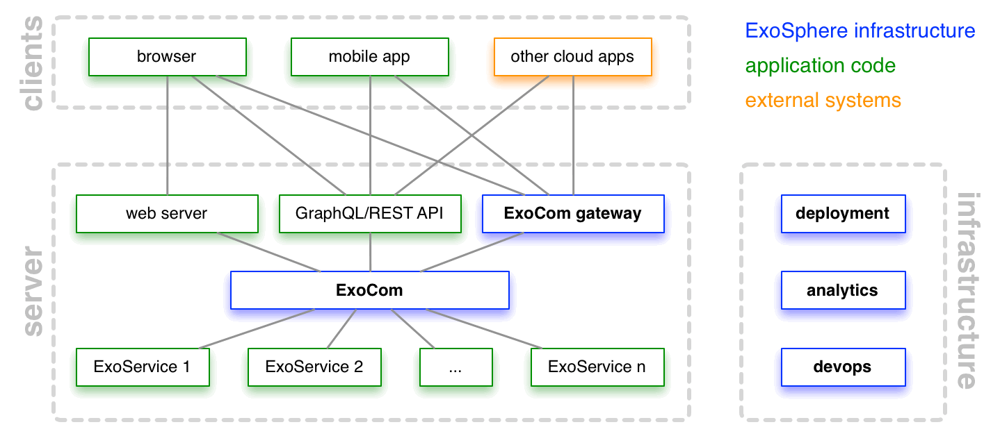

# Exosphere Application Architecture

Exosphere makes it very easy to create
applications consisting of lots of backend services,
and strongly encourages this pattern.

## Architecture

The graphic below shows the architecture of a simple Exosphere application.

* the application code is factored into individual services
  (shown in green)
* each service has one responsibility, and provides that generic and well
* service communicate via JSON (the universal data exchange language)
* ExoSphere (shown in blue)
  provides a shared communication bus called _ExoCom_
  for this application.
* the communication bus can be extended to clients via the _ExoCom gateway_
* Exosphere provides infrastructure services
  like full-stack deployment, analytics, and devops support
  for the application

## Example applications

* [Todo app](): a simple to-do list application
* [Space-Tweet](https://github.com/Originate/exosphere--example-app--space-tweet):
  a medium-sized Exosphere application
