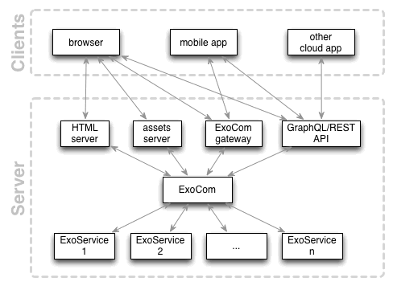

# Exosphere SDK Documentation

The Exosphere SDK allows to develop Exosphere applications locally.

## Architecture

The SDK is comprised of the following subprojects:

* [exosphere-cli](https://github.com/Originate/exosphere-cli):
  CLI to start/deploy whole Exosphere applications
* [exoservice-js](https://github.com/Originate/exoservice-js):
  a high-level, opinionated framework for creating microservices
  in Node.js.
  An example microservice created with ExoServiceJS is
  [here](https://github.com/Originate/exosphere-users-service).
* [LiveScript Exoservice Generator](https://github.com/Originate/generator-exoservice-livescript):
  Scaffolds an [exoservice-js](https://github.com/Originate/exoservice-js)
  instance in LiveScript.
* [exorelay-js](https://github.com/Originate/exorelay-js):
  provides Exosphere communication services to larger Node.js applications
  like web or API servers
* [exocomm-dev](https://github.com/Originate/exocomm-dev):
  a simple in-memory implementation of the Exosphere messaging infrastructure
  for local development.
* [exocomm-mock-js](https://github.com/Originate/exocomm-mock-js):
  a mock implementation of
  [exocomm-dev](https://github.com/Originate/exocomm-dev)
  for testing ExoServices

## Example applications

* [Space-Tweet](https://github.com/Originate/exosphere--example-app--space-tweet): a Twitter clone written as an Exosphere application

## Getting started

* check out some [example applications](#example-applications)
* install the SDK and run the example applications on your machine
* write your own Exosphere applications
