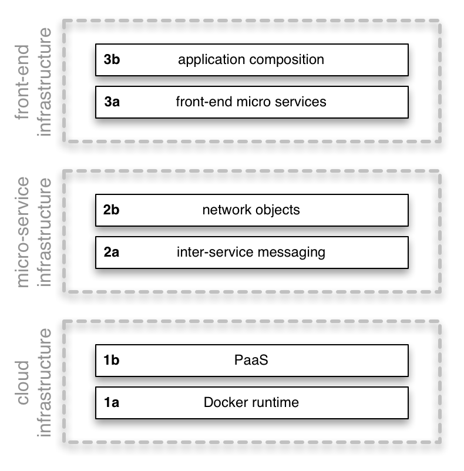

<table>
  <tr>
    <td><a href="01_design_goals.md">&lt;&lt; design goals</a></td>
    <th>Exosphere architecture</th>
    <td><a href="03_installation.md">installation &gt;&gt;</a></td>
  </tr>
</table>

# Exosphere Architecture

Exophere consists of an open-source developer SDK and a scalable cloud runtime.

## Developer SDK

The Developer SDK is open source
and allows to develop Exosphere applications on Windows, OS X, and Linux computers.
It consists of a command-line tool that scaffolds, tests,
runs, and deploys Exosphere code bases.
The SDK can also be used to run Exosphere applications
in on your own production infrastructure.

## Cloud runtime

The Exosphere Cloud Runtime is operated by Originate
and provides professional, cost-efficient hosting and maintenance of Exosphere apps.

## Standing on the shoulders of giants

There are practical limits to the size of software projects.
We can only build so many layers of abstraction
on top of the foundation we stand on
before our team and code sizes and their complexity collapse
under their own weight.

This means the level of the foundation that we build upon
determines the complexity and
sophisticaation of our applications.
We are dwarfs standing on the shoulders of giants1.
If we want to build high-level applications economically,
we have to build on top of a high-level foundation.

Exosphere is designed to provide support on many levels.
Exosphere application developers can choose the right balance
of easy to use via opinionated, high-level conventions
vs freedom to do things however they want to,
the latter at the cost of having to build more infrastructure manually.

Exosphere has 3 main layers.
Each one consists of a generic foundation based on a popular open source technology,
on top of which is more opinionated, high-level support.

<table>
  <tr>
    <th>1a</th>
    <td>
      At the basic level Exosphere is just a cloud runtime for Docker images.
      This is where you run legacy applications.
      An Exosphere application is made out of a number of code bases running together.
    </td>
  </tr>
  <tr>
    <th>1b</th>
    <td>
      On top of the Docker runtime is an opinionated Heroku-like PaaS
      that provides databases, caches, and other resources to running code.
    </td>
  </tr>
  <tr>
    <th>2a</th>
    <td>
      A generic messaging infrastructure for asynchronous communication
      of services running inside Docker.
    </td>
  </tr>
  <tr>
    <th>2b</th>
    <td>
      Opinionated, high-level support to treat services as reusable _network objects_
      interacting with each other via message passing.
    </td>
  </tr>
  <tr>
    <th>3a</th>
    <td>
      A generic extension of the message bus to the front-end
      (web browsers, mobile applications) to leverage the same benefits
      on the front-end and provide a foundation for real-time applications.
    </td>
  </tr>
  <tr>
    <th>3b</th>
    <td>
      Opinionated, high-level support for quickly assempling
      application from full-stack application parts
    </td>
  </tr>
</table>

<ol>
  <li>
    Those "giants" are really just other dwarfs, standing on more dwarfs.
    Its dwarfs all the way down. There are no giants.
    You can participate in this like anybody else.
    Even the smallest contribution is huge
    if others can build on top of it!
  </li>
</ol>
