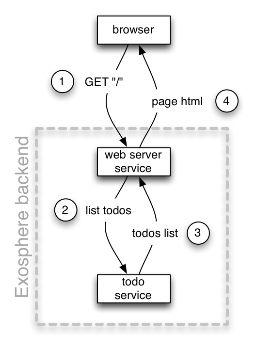

<table>
  <tr>
    <td><a href="02_web_server.md">&lt;&lt; the web server service</a></td>
    <th>Exosphere Design Goals</th>
    <td><a href="02_create_internal_service.md">creating an internal service &gt;&gt;</a></td>
  </tr>
</table>


# Communication

<table>
  <tr>
    <td>
      <b>
      <i>
        status: alpha - rough version implemented, needs planned extensions and refinements
      </i>
      </b>
    </td>
  </tr>
</table>

__Table of Contents__
* [Exocom](#exocom)
* [Terminology](#terminology)
* [Message Format](#message-format)
* [Outcomes](#outcomes)
* [Idempotency](#idempotency)
* [Streaming Replies](#streaming-replies)
* [Exorelays](#exorelays)
* [Subscription Model](#subscription-model)

<hr>

Next we will build the service that stores the todo lists and entries.
Integrating it into our application will result in roughly this architecture:

<table>
  <tr>
    <td width="400">
      
    </td>
    <td>
      <ol>
        <li>
          The user browses to our homepage.
          To display that page,
          her browser makes an HTML request for it.
          <br>&nbsp;
        </li>
        <li>
          The homepage is now contains the todo list.
          To render it, the web server service asks
          the Todo service for that list.
          <br>&nbsp;
        </li>
        <li>
          The Todo service replies to [2] with a list of todo entries.
          <br>&nbsp;
        </li>
        <li>
          With the todo entries available,
          the web server renders the HTML for the home page
          and replies to the HTTP request made in (1).
        </li>
      </ol>
    </td>
  </tr>
</table>

Let's talk about how this communication is implemented in Exosphere.

Exosphere applications end up having a lot (dozens, hundreds) of services
that need to communicate with each other.
If all these services would try to talk directly to each other,
as depicted above,
all of them would have to:

* figure out where all the other services are and keep this address list up to date
* know how to talk to every service's API in its own specific way
* enforce security, like verifying who the sender of a message was,
  whether it was allowed to send that message,
  and negotiate a way to encrypt messages along the way that works for both.
* monitor traffic patterns and raise alarms for suspicious ones
  that might indicate a hacker attack
* handle edge cases like re-sending a message when the receiver doesn't respond
* report sent messages to a logging server to support monitoring and debugging

If each service would do all this by themselves,
each one would do it slightly differently and inconsistently.
This would be wasteful, inefficient, and frustrating to work with.
Its better to centralize and standardize such functionality into communication infrastructure.


## Exocom

In Exosphere, services talk over a message bus called __Exocom__,
which is short for <b>Exo</b>sphere <b>Com</b>munication.
It allows the different application services to communicate with each other.
This communication is fully asynchronous and decoupled in:
* _space:_ the sender does not need to know the address of the receiver.
  It simply shouts out the message and trusts that the receivers will hear it.

* _time:_ the receiver doesn't have to be online and ready to receive
  when the message is sent.
  Sent messages waits in a queue until the receiver is ready to process it.

This means messages are fire-and-forget.
You send off a message, and if there is a response, you will receive it
as a separate message.

Here is how the actual communication architecture of our application,
including Exocom,
looks like:

<table>
  <tr>
    <td width="280">
      
    </td>
    <td>
      <ol>
        <li>
          The user browses to our homepage.
          To display that page,
          her browser makes an HTTP request for it.</li>
          <br>&nbsp;
        <li>
          The web server requests the list of todo items
          by sending a `todos.list` message to ExoCom
          <br>&nbsp;
        </li>
        <li>
          ExoCom sends this message to the Todo service
          <br>&nbsp;
        </li>
        <li>
          The Todo service replies to ExoCom with the list of todo entries.
          <br>&nbsp;
        </li>
        <li>
          ExoCom sends this reply to the web server service.
          <br>&nbsp;
        </li>
        <li>
          The web server renders the HTML for the home page
          and replies to the HTTP request made in [1].
        </li>
      </ol>
    </td>
  </tr>
</table>

This looks more complex on the surface, but it is actually simpler,
especially when there are more than 2 services involved.
Notice how how both the web server and the Todo service
don't need to know about each other anymore?
Nor need to be able to talk directly to each other?
The just talk to ExoCom.
This greatly simplifies implementing the communication logic in them.
Only ExoCom needs to know the address of services.
It also makes communication secure:
ExoCom centralizes logic to verify
whether a service is allowed to send or receive a particular message.
The services can be in separate network partitions
to isolate them from each other
for security reasons,
ExoCom re-sends messages when services crash,
and monitors the ongoing traffic and load patterns.


## Terminology

Let's quickly clarify the vocabulary used,
since we deal with two types of requests now.

Services send each other __messages__ via Exocom.
To send a message, a service makes a network __request__ to
[ExoCom](https://github.com/Originate/exocom-dev).
The __response__ for this network request only indicates
whether the message was correctly sent,
i.e. whether it was correctly formatted,
not whether it was executed successfully by its receivers.
ExoCom then performs additional requests to the receiving services
in order to deliver the message to them.

There are two types of messages:
* __commands__ are normal messages sent to another service
  in order to make it do something.
  An example is the web server sending the users service the _"user.create"_
  command to create a new user account.

* __replies__ are messages sent in response to a previously received command.
  They contain the __outcome__ of the command that triggered them.
  In our example, the users service would reply to a received _"user.create"_ command
  with a _"user.created"_ message containing the created user account.


## Message Format

While we are at it, let's also take a look at the data format of messages:

<table>
  <tr>
    <th></th>
    <th>type</th>
    <th>description</th>
    <th>example</th>
  </tr>
  <tr>
    <th>name</th>
    <td>string</td>
    <td>type of the message sent</td>
    <td>"user.create"</td>
  </tr>
  <tr>
    <th>version</th>
    <td>number</td>
    <td>version of the API talked to</td>
    <td>1.2</td>
  </tr>
  <tr>
    <th>payload</th>
    <td>JSON</td>
    <td>data payload for the message</td>
    <td>{"name": "Jean-Luc Picard"}</td>
  </tr>
  <tr>
    <th>id</th>
    <td>UUID</td>
    <td>guid of the message</td>
    <td>7294be20-e034-11e5-bbcc-1d18f38c4e43</td>
  </tr>
  <tr>
    <th>timestamp</th>
    <td>unix time in nanoseconds</td>
    <td>time when this message was sent (determined by Exocom)</td>
    <td>987234987234987</td>
  </tr>
  <tr>
    <th>originId</th>
    <td>UUID</td>
    <td>guid of the event that caused this activity (user activity or cron job)</td>
    <td>23d09070-e098-11e5-91a5-a7f02faca148</td>
  </tr>
  <tr>
    <th>responseTo</th>
    <td>UUID</td>
    <td>id of the command replied to here</td>
    <td>89934740-e034-11e5-bbcc-1d18f38c4e43</td>
  </tr>
  <tr>
    <th>sender</th>
    <td>string</td>
    <td>name of the service that sends the message</td>
    <td>"web"</td>
  </tr>
</table>

The structure of the payload can be defined using
[JSON schema](http://json-schema.org).


## Outcomes

Service calls are higher-level than simple function calls within a code base.
They cross functional boundaries,
perform dedicated, isolated units of work,
and take time.
Hence they often have more complex APIs than simple function calls.

* replies to commands often include the new state caused by a state changing command,
  to avoid having to do another round trip across the network to query the new state
* high-level service calls can often have more than one outcome.
  For example, a message encoding the command
  _"transfer $100 from the checking account to the savings account"_,
  sent to an account service, could produce any of these outcomes:

  <table>
    <tr>
      <th>transferred</th>
      <td>the money was transferred</td>
    </tr>
    <tr>
      <th>pending</th>
      <td>the transfer was initiated, but is pending a third-party approval</td>
    </tr>
    <tr>
      <th>transaction limit exceeded</th>
      <td>the account doesn't allow that much money to be transferred at once</td>
    </tr>
    <tr>
      <th>daily limit exceeded</th>
      <td>the daily transaction limit was exceeded</td>
    </tr>
    <tr>
      <th>insufficient funds</th>
      <td>there isn't enough money in the checking account</td>
    </tr>
    <tr>
      <th>unknown account</th>
      <td>one of the given accounts was not found</td>
    </tr>
    <tr>
      <th>unauthorized</th>
      <td>the currently logged in user does not have privileges to make this transfer</td>
    </tr>
    <tr>
      <th>internal error</th>
      <td>an internal error occurred in the accounting service</td>
    </tr>
  </table>

The boundaries between "success" and "no success",
between "user error" and "application error" are blurry here.
Is a pending transaction a success? It doesn't feel like an error,
but the money also hasn't been transferred as requested.
Is a "transaction limit exceeded" outcome a user error?
Could/should the app have warned the user before even trying a transaction
that it later figures out will fail?
Because of this, its better to model outcomes in the application's domain language,
and configure monitoring and alerts in the application's analytics system.


## Idempotency

Replies to commands can get lost,
causing the sender to assume the transaction didn't happen
and re-sending the command.
Services must be able to recognize and deal with this situation.
For example, transactions that changes state
should keep a history of the recently performed commands
and check it for matches before executing an incoming command.


## Streaming Replies

Services can send more than one reply to a command.
In this case we have a _message stream_ that encodes a _streaming reply_.

One use case are streaming responses,
where a larger result is sent in a series of chunks:
Here is how this looks like using [ExoRelay.JS](https://github.com/Originate/exorelay-js)
in [LiveScript](http://livescript.net):

```livescript
exoRelay.send 'file.read', path: 'large.csv', (payload, {outcome}) ->
  switch outcome
    | 'file.read-chunk'  =>  result += payload
    | 'file.read-done'   =>  console.log "finished reading #{payload.megabytes} MB!"
```

Another use case for streaming replies is making longer-running commands responsive.
Let's say we have a "blob" service that stores large files.
Copying a larger file might take a minute or two,
so we want to display a progress bar to the user.
To make this easy,
the "blog" service sends streaming replies to the "file.copy" command.

```livescript
exoRelay.send 'file.copy', from: 'large.csv', to: 'backup.csv', (payload, {outcome}) ->
  switch outcome
    | 'file.copy.in-progress'  =>  console.log "copying, #{payload.percent}% done"
    | 'file.copy.done'         =>  console.log 'file copy finished!'
```

Note:
This is a quick solution for simple use cases.
If this transaction takes a longer time,
or other services want to access or monitor it as well,
you want to build your own dedicated transaction model here.


## Exorelays

The Exosphere SDKs provides drivers
that encapsulate the logic
for talking to ExoCom.
They are called __ExoRelays__,
since they relay messages between services.
Each service contains exactly one Exorelay instance.


Exosphere provides ExoRelays for most popular languages.
It is easy to write additional Exorelays for your stack.
In this tutorial we use [ExoRelay-JS](https://github.com/originate/exorelay-js)
for Node.JS code bases.

Let's add an ExoRelay to our web server:

```
$ cd ~/todo-app/web-server
$ npm install --save exorelay
```

Now use the ExoRelay in the web server code:

__~/todo-app/web-server/server.js__

```javascript
const ExoRelay = require('exorelay');
const express = require('express');

const exoRelay = new ExoRelay({serviceName: process.env.SERVICE_NAME,
                               exocomPort: process.env.EXOCOM_PORT});
exoRelay.listen(process.env.EXORELAY_PORT);
exoRelay.on('error', (err) => { console.log(`Error: %{err}`); });
exoRelay.on('online', () => {

  const app = express();
  app.set('view engine', 'jade');

  app.get('/', (req, res) => {
    exoRelay.send('todos.list', (todos) => {
      res.render('index', {todos: todos});
    });
  });

  app.listen(3000, () => {
    console.log('Todo web server listening on port 3000');
  });

});
```

What we do differently now:
* we import the `ExoRelay` class from the `exorelay` NPM module
  and create an instance of it called `exoRelay`
* we configure it with a number of environment variables,
  which are provided by Exosphere
* once we have connected our ExoRelay instance to ExoCom,
  we take our web server online as usual
* in the request handler for `/`, we send out a `todos.list` message
  and give it a callback function
* when the response arrives, it runs our callback,
  which renders the `index` view and gives it the `todos` variable as payload
