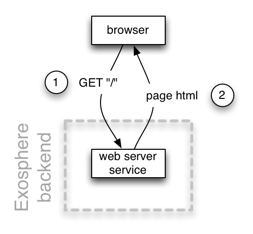

<table>
  <tr>
    <td><a href="04_microservices.md"><b>&lt;&lt;</b> microservices</a></td>
    <th>The Web Server Service</th>
    <td><a href="06_helper_apps.md">helper apps <b>&gt;&gt;</b></a></td>
  </tr>
</table>


# The Web Server Service

<table>
  <tr>
    <td>
      status: beta - mostly implemented, needs robustness improvements
    </td>
  </tr>
</table>

Let's build the first service for our web application:
the web server!
If we would be building our Todo app as a traditional monolithic application,
the web server would be the only code base
and perform all of the application's functionality:
receiving requests,
storing todo-items in the database,
configuring and using the search engine,
tracking user sessions and permissions,
rendering HTML for the browser, JSON for the REST API,
etc.

In Exosphere's microservice world,
each code base has only one responsibility.
The web server's job is to interact with the user via an HTML UI.
Most of the things mentioned above are not a direct part of this responsibility,
and are therefore implemented outside of the web server, as separate services.
Because of this much narrower set of responsibilities,
the web server is a lot smaller and simpler
than it would be in a traditional monolithic application.

Since our web server is so simple,
we'll build it using [ExpressJS](http://expressjs.com).
Exosphere comes with a template for building ExpressJS web servers.
Let's use it:

```
cd ~/todo-application
exo add service
```

Again, the generator asks for the information it needs interactively.
Please enter:

<table>
  <tr>
    <th>prompt</th>
    <th>text you enter</th>
  </tr>
  <tr>
    <td>Name of the service to add</td>
    <td>web</td>
  </tr>
  <tr>
    <td>Description</td>
    <td>web server</td>
  </tr>
  <tr>
    <td>type</td>
    <td>webserver-express-es6</td>
  </tr>
  <tr>
    <td>Initial version</td>
    <td>(press [Enter] to accept the default value of 0.0.1)</td>
  </tr>
</table>

Now we see the service registered in our application configuration file:
__application.yml__

```yml
name: Todo application
description: An example Exosphere application
version: '0.0.1'

services:
  web:
    location: ./web-server
```

Here is the current architecture of our application:

<table>
  <tr>
    <td width="280">
      
    </td>
    <td>
      <ol>
        <li>
          The user browses to our homepage.
          In order to show that page, her web browser requests the HTML for it.
        </li>
        <li>
          This request goes to our <i>web server service</i>.
          It replies with the HTML for the page.
        </li>
      </ol>
    </td>
  </tr>
</table>


## The web service folder

The web service is located in a subdirectory of the application,
in `~/todo-app/web/`.
This makes sense because it is an integral part of our application,
and doesn't make sense outside of it.

Most of the files in this folder
are just a normal [ExpressJS](http://expressjs.com) application,
plus some extra tools like linters.
Let's see what we got by running:

```
$ exo run
```

and going to [localhost:3000](http://localhost:3000).


## the server controller file

This file implements the web server controller logic.

__~/todo-app/web-server/server.js__

```javascript
const express = require('express');
const app = express();
app.set('view engine', 'jade');

app.get('/', (req, res) => {
  res.render('index');
});

app.listen(3000, () => {
  console.log('Todo web server listening on port 3000');
});
```


## the server view file

This file implements the HTML for the home page.

__~/todo-app/web-server/views/index.jade__

```jade
html
  body
    h1 Todo App
    p Remember all the things!
```


## the service configuration file

This file tells Exosphere everything it needs to know about this service.

__~/todo-app/web-server/config.yml__

```yml
name: Todo web server
description: serves the web UI of the Todo app

startup:
  online:
    console-output: Todo web server listening on port

messages:
  sends:
  receives:
```

This configuration file specifies:
* The service __name__ and a __description__
* The __startup__ section defines how to determine when the service is fully started up.
  In this case the server signals that by printing
  `Todo web server listening on port 3000`
  on the console.
  Exosphere only sends traffic to fully available instances.
* The __messages__ section lists all the messages that this service will send and receive.
  Exosphere needs this information
  in order to automatically subscribe the service to these messages.
  Currently our application doesn't contain any other services
  that could be communicated with,
  so this section is empty for now.
  We'll add some commands here soon!


## the "package.json" file

This file is required by the package management system of Node.JS.
It lists the Node libraries we use to build this service.
We use [ExpressJS](http://expressjs.com) as our web server framework,
and [Jade](http://jade-lang.com) as our template engine.

__~/todo-app/web-server/package.json__

```json
{
  "dependencies": {
    "express": "^4.0.0",
    "jade": "^1.0.0"
  }
}
```


## Setting up the service

With all files in place,
Exosphere has all the information to set up our application.
Let's check that the overall configuration is correct,
and have Exosphere set up the service for us:

```
$ exo setup
```

We see how it uses Node's package management system (NPM)
to download and install
the external ExpressJS and Jade modules for us,
so that the service is ready to run.
The output should look something like:

```
Exosphere SDK 0.6.3

Setting up Todo application 0.0.1

exo-setup  starting setup of 'web'
      web  /Users/kevin/exosphere-sdk/tutorial/part_2/code_02/todo-app/web-server
├── express@4.13.4
└── jade@1.11.0
      web  PROCESS ENDED
      web  EXIT CODE: 0
exo-setup  setup of 'web' finished
exo-setup  setup complete
```


## Booting up the application

To test that everything works, let's check that the application boots up:

```
$ exo run
```

You should see output like:

```
Exosphere SDK 0.6.3

Running Todo application 0.0.1

 exocom  online at port 8000
    web  Server running at port 3000
 exorun  'web' is running using exorelay port 8001
 exorun  all services online
 exocom  received routing setup
 exorun  application ready
```

Exosphere itself is written as a bunch of loosely coupled services.
We see a number of them in action here:
* __exorun__ is the command that runs Exosphere applications.
  It starts the other services.
* __web__ is our web server service.
  We can see that exorun starts it,
  and recognizes right after the output `Todo app running at port 3000`
  that our web server is online.
* Exosphere also starts a service called __exocom__.
  This is the messaging system
  for communication between services.
  More about it later.

Finally, exorun tells us that the application is now fully started
and ready to be used.
Open a browser and navigate to [http://localhost:3000](http://localhost:3000).
We got a running microservice-based web site!

Takeaway:
> The web server in a microservice application is much simpler than in a monolith,
> because it only focuses on interacting with the user via HTML.

Next, let's look at how services communicate with each other!

<table>
  <tr>
    <td><a href="06_helper_apps.md"><b>&gt;&gt;</b></a></td>
  </tr>
</table>
