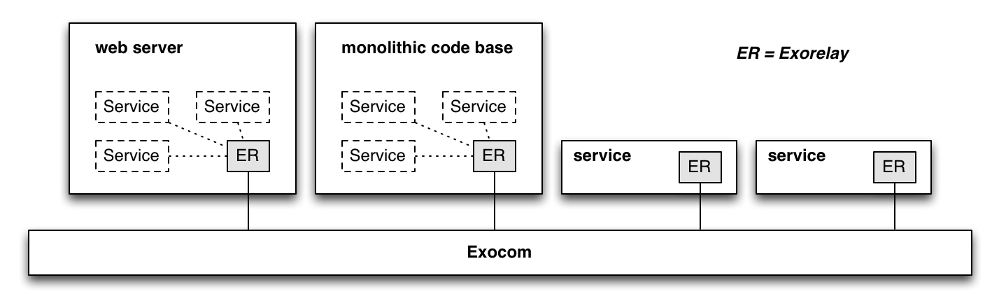

<table>
  <tr>
    <td><a href="05_web_server.md"><b>&lt;&lt;</b> the web server service</a></td>
    <th>Inter-Service Communication</th>
    <td><a href="07_add_exorelay_to_web.md">add exorelay to the web server <b>&gt;&gt;</b></a></td>
  </tr>
</table>


# Inter-Service Communication

<table>
  <tr>
    <td>
      <b>
      <i>
        status: beta - rough version implemented, needs more testing and solidifications
      </i>
      </b>
    </td>
  </tr>
</table>


Next we are going to add the ability to store todo lists to our application.
In a service-oriented architecture this will be implemented separately from the web server,
since storing todo items is a different responsibility than serving HTML pages to browsers.
Conceptually, a request to the homepage,
which is now supposed to contain a list of todo items,
would follow this rough workflow:

<table>
  <tr>
    <td width="400">
      
    </td>
    <td>
      <ol>
        <li>
          The user browses to our homepage.
          To display that page,
          her browser makes an HTML request for it.
          <br>&nbsp;
        </li>
        <li>
          The homepage is now supposed to contain a todo list.
          The <i>web server</i> service asks
          the <i>Todo service</i> for that list.
          <br>&nbsp;
        </li>
        <li>
          The Todo service loads the list from its database
          and replies to [2] with the todo list data.
          <br>&nbsp;
        </li>
        <li>
          The web server can now render the HTML for the home page
          and reply to the HTTP request made in [1].
        </li>
      </ol>
    </td>
  </tr>
</table>

Before we implement this,
let's take a look at how services interact with each other in Exosphere.


## Asynchronous Communication

Traditional web services are accessed with normal, direct network requests,
for example to a REST interface.
This is simple and fast,
and works well if there are only a few services.
As we scale to dozens or hundreds of them,
this synchronous communication model starts to become painful, though.
Each service:
* needs to figure out where all the other services are
  and keep this address list up to date
* handle edge cases like re-sending a message when the receiver doesn't respond,
  for example because it is currently being upgraded or restarted
* report sent messages to a logging server to support monitoring, debugging, and real-time analytics

Asynchronous communication solves many of these issues.
In Exosphere, communication is therefore decoupled in:
* space: The sender doesn't send a message to a particular address.
         It broadcasts it,
         and the messaging infrastructure routes it to the right receivers
         based on its content and metadata.

* time: A command isn't directly answered in the same network request.
        It is buffered until the receiver can get to processing it,
        and the receiver sends one (or multiple) replies as separate messages,
        at a later time.


## Exocom

Communication between services requires a lot of boilerplate activities.
Each service must:
* know how to talk to every other service's API in its own specific way,
  in regards to authentication, data formats, URL endpoints etc.
* enforce security, like verifying who the sender of a message was,
  whether it was allowed to send that message,
  and negotiate a way to encrypt messages along the way that works for both.
* monitor traffic patterns and raise alarms for suspicious changes
  that might for example indicate a hacker attack

If each service would have to do all this by itself,
they would all do it slightly differently and inconsistently.
And with only 20 services we already have 190 potential connections!
This quickly becomes inefficient and frustrating.
Such infrastructural functionality should be centralized and standardized
by the framework.

Exosphere services talk to each other over a message bus called __Exocom__,
which is short for <b>Exo</b>sphere <b>com</b>munication.
Here is how the workflow described above would be implemented in Exosphere:

<table>
  <tr>
    <td width="300">
      
    </td>
    <td>
      <ol>
        <li>
          The user browses to our homepage.
          To display that page,
          her browser makes an HTTP request for it.
          <br>&nbsp;
        </li>
        <li>
          The web server requests the list of todo items
          by sending a <code>todos.list</code> message to ExoCom
          <br>&nbsp;
        </li>
        <li>
          ExoCom sends this message to the Todo service,
          because it knows that this service can understand it.
          <br>&nbsp;
        </li>
        <li>
          The Todo service loads the todo entries from its database and
          replies to ExoCom with a <code>todos.listing</code> message.
          <br>&nbsp;
        </li>
        <li>
          ExoCom forwards this reply to the web server service.
          <br>&nbsp;
        </li>
        <li>
          The web server renders the HTML for the home page
          and replies to the HTTP request made in [1].
        </li>
      </ol>
    </td>
  </tr>
</table>

This looks more complex on the surface, but it is actually simpler,
especially when there are more than 2 services involved.
Notice how how both the web server and the Todo service
don't need to know about each other anymore,
nor need to be able to talk directly to each other?
The just talk to ExoCom.
This greatly simplifies implementing the communication logic in them.

Only ExoCom needs to know the addresses of services,
and being a part of the framework that deploys services
it has direct access to this information.
ExoCom centralizes logic to verify
whether a service is allowed to send or receive a particular message.
The services can now be isolated from each other in separate network partitions
for security reasons,
ExoCom re-sends messages when services crash,
and monitors and analyzes the ongoing traffic, load patterns, response times, and failure rates,
and makes this data available to monitors and auto-scalers for services.
Exocom is also a great place to debug application logic as it flows across services,
since pretty much all application traffic goes through it.


## Terminology

Let's quickly clarify the vocabulary used,
since we deal with three types of requests now.

An end user performs an __activity__ using the application.
In this case she browses the home page.
Other activities could be that the user creates a new todo entry,
or a cron job performs some scheduled activity every night.

To perform an activity,
the services within the application exchange a number of __messages__.
An example is the `todos.list` message,
which means "I need the todo items for user XYZ".

To send a message,
a service makes a network __request__ to
[ExoCom](https://github.com/Originate/exocom-dev).
The __response__ for this network request only indicates
whether the message was correctly sent,
i.e. whether its payload was correctly formatted,
not whether it was executed successfully by its receivers.
Exocom then performs additional _requests_ to the receiving services
in order to deliver the message to them.

There are two types of messages:
* __commands__ are normal messages sent to another service
  in order to make it do something.
  An example is the web server sending the todo service a `todo.create`
  command to create a new todo entry.

* __replies__ are messages sent in response to a previously received command.
  They reference the command that caused them,
  and contain the __outcome__ of what they did to satisfy the command.

Typically, commands are in imperative ("create").
Replies are verbs,
either in present continuous tense ("creating")
to indicate that an activity is occurring right now,
or in past tense ("created")
to indicate that an activity has occurred and is finished now.

To save on (expensive) network round trips,
replies often contain the new state caused by a command in their data payload,
for example the created todo entry
and maybe the new total number of todo entries.


## Outcomes

Commands, i.e. service calls, are higher-level operations
than simple function calls.
They cross functional boundaries within the application,
i.e. go from one part of the application (the web server) to a different part (the todo service).
They typically perform higher-level and more complex work than simple function calls,
and can therefore have more complex outcomes with a wider spectrum of shades of grey.

For example, a message encoding the command
_"transfer $100 from the checking account to the savings account"_,
sent to an account service, could produce any of these outcomes:

<table>
  <tr>
    <th>transferred</th>
    <td>the money was transferred</td>
  </tr>
  <tr>
    <th>pending</th>
    <td>the transfer was initiated, but is pending a third-party approval</td>
  </tr>
  <tr>
    <th>transaction limit exceeded</th>
    <td>the account doesn't allow that much money to be transferred at once</td>
  </tr>
  <tr>
    <th>daily limit exceeded</th>
    <td>the daily transaction limit was exceeded</td>
  </tr>
  <tr>
    <th>insufficient funds</th>
    <td>there isn't enough money in the checking account</td>
  </tr>
  <tr>
    <th>unknown account</th>
    <td>one of the given accounts was not found</td>
  </tr>
  <tr>
    <th>unauthorized</th>
    <td>the currently logged in user does not have privileges to make this transfer</td>
  </tr>
  <tr>
    <th>internal error</th>
    <td>an internal error occurred in the accounting service</td>
  </tr>
</table>

The boundaries between _success_ and _no success_,
between _user error_ and _application error_ are blurry here.
Is a pending transaction a success? It doesn't feel like an error,
but the money also hasn't been transferred as requested.
Is a "transaction limit exceeded" outcome a user error?
Could/should the computer have warned the user
before even allowing her to try a transaction that it later determines will fail?
Because of this, its better to model outcomes in the application's domain language,
and configure monitoring and alerts in the application's analytics system.


## Message Format

While we are at it, let's take a quick look at what metadata messages contain:

<table>
  <tr>
    <th></th>
    <th>type</th>
    <th>description</th>
    <th>example</th>
  </tr>
  <tr>
    <th>name</th>
    <td>string</td>
    <td>type of the message sent</td>
    <td>"user.create"</td>
  </tr>
  <tr>
    <th>version</th>
    <td>number</td>
    <td>version of the API talked to</td>
    <td>1.2</td>
  </tr>
  <tr>
    <th>id</th>
    <td>UUID</td>
    <td>guid of the message</td>
    <td>7294be20-e034-11e5-bbcc-1d18f38c4e43</td>
  </tr>
  <tr>
    <th>timestamp</th>
    <td>unix time in nanoseconds</td>
    <td>time when this message was sent (determined by Exocom)</td>
    <td>987234987234987</td>
  </tr>
  <tr>
    <th>activityId</th>
    <td>UUID</td>
    <td>guid of the event that caused this message (user activity or cron job)</td>
    <td>23d09070-e098-11e5-91a5-a7f02faca148</td>
  </tr>
  <tr>
    <th>responseTo</th>
    <td>UUID</td>
    <td>id of the command replied to here</td>
    <td>89934740-e034-11e5-bbcc-1d18f38c4e43</td>
  </tr>
  <tr>
    <th>sender</th>
    <td>string</td>
    <td>name of the service that sends the message</td>
    <td>"web"</td>
  </tr>
</table>

The payload can be provided in any way the applications wants to,
for example as JSON, [MsgPack](http://msgpack.org), using
[Protocol Buffers](https://developers.google.com/protocol-buffers), or
[Thrift](https://thrift.apache.org).


## Streaming Replies

Services can send more than one reply to a command.
In this case we have a _message stream_ that encodes a _streaming reply_.

One use case are streaming responses,
where a larger result is sent in a series of chunks:
As an example, here is how a large file is read in chunks using
[ExoRelay.JS](https://github.com/Originate/exorelay-js) and
[LiveScript](http://livescript.net):

```livescript
exoRelay.send 'file.read', path: 'large.csv', (payload, {outcome}) ->
  switch outcome
    | 'file.read-chunk'  =>  result += payload
    | 'file.read-done'   =>  console.log "finished reading #{payload.megabytes} MB!"
```

Another use case for streaming replies is making longer-running commands responsive.
Let's say we have a "blob" service that stores large files.
Copying a larger file might take more than a few seconds,
so we want to display a progress bar to the user.
To make this easy,
the "blog" service sends streaming replies to the "file.copy" command.

```livescript
exoRelay.send 'file.copy', from: 'large.csv', to: 'backup.csv', (payload, {outcome}) ->
  switch outcome
    | 'file.copy.in-progress'  =>  console.log "copying, #{payload.percent}% done"
    | 'file.copy.done'         =>  console.log 'file copy finished!'
```

Note:
This is a quick solution for simple use cases.
If this transaction takes a longer time,
or other services want to access or monitor it as well,
you want to build your own dedicated transaction model.


## Idempotency

Messages can get lost,
causing the sender to assume the transaction didn't happen
and re-sending a command.
Services must be able to recognize and deal with this situation.
For example, transactions that changes state
should keep a history of the recently performed commands
and check it for matches before executing an incoming command.


## Exorelays

The Exosphere SDKs provides drivers
that encapsulate the logic
for talking to ExoCom.
They are called __ExoRelays__,
since they relay messages between services.
Each service contains exactly one Exorelay instance.



Exosphere provides ExoRelays for most popular languages.
It is easy to write additional Exorelays for your stack.


<table>
  <tr>
    <td><a href="07_add_exorelay_to_web.md"><b>&gt;&gt;</b></a></td>
  </tr>
</table>
