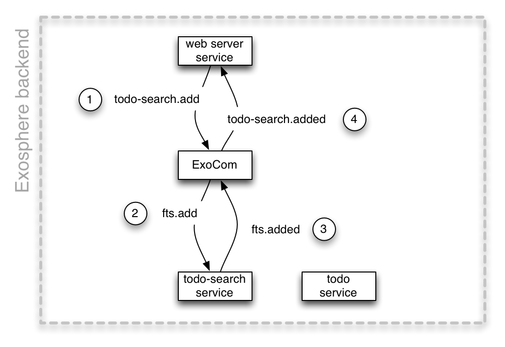

<table>
  <tr>
    <td><a href="03_communication.md">&lt;&lt; message-oriented programming</a></td>
    <th>Reusability</th>
    <td><a href="07_nox.md">service-oriented data modeling &gt;&gt;</a></td>
  </tr>
</table>


# Generic Services

<table>
  <tr>
    <td>
      <b><i>
        Status: beta - implemented, needs feedback
      </i></b>
    </td>
  </tr>
</table>


Next we add the ability to search for todo items.
We could add a "search" endpoint to our exising service that stores todo items
and implement search using its internal MongoDB database.

There are several reasons why this is not a good idea though:

* We might want to use more search capabilities
  than our database provides (fuzzy search, finding synonyms, etc).

* Exosphere already has an off-the-shelf fulltext-search service.
  It took a while to build, secure, and scale it.
  We don't want to re-do all this work in each of our services.

* Search traffic patterns and availability requirements
  are often different than for CRUD traffic.
  Search index updates are usually more expensive than normal database updates.
  We might want to batch-update the search engine only every couple of seconds.
  This would be completely inappropriate behavior for the main database.
  Optimizing a single database for both CRUD and search traffic will be difficult at scale.


Here are a few generic and reusable off-the-shelf services provided by Exosphere:
* users service
* password auth service
* session service
* search service

All of these services are robust, secure, and scalable.
Building Exosphere applications is quite different than building monolithic applications:
Especially in the beginning,
one usually plugs some generic services together like [Lego]() bricks.
This allows to rapidly prototype fully functional and scalable applications together,
and only spend time engineering application-specific components
when outgrowing the abilities of the generic building blocks<sup>2</sup>.
And then it is very easy to replace parts of the application with others,
because being built as separate services makes them very loosely coupled
from each other.


## Translating messages

In the [documentation for the search service]()
we see that it expects the commands `fts.add` to data to the search engine,
and `fts.search` to perform a fulltext search.

We want to use domain-specific commands though,
like `todo-search.add` and `todo-search.search`.
So that searching for todos is
(A) intuitive by using our domain model terminology, and
(B) applicable to multiple data models.
For example, when we add search for user accounts,
we want to be able to spin up another search engine,
and talk to it via `user-search.add` and `user-search.search`.

Exosphere supports this via runtime message translation:
* the fulltext-search service defines that it uses the message namespace `fts.*`
  and subscribes to the `fts.add` command
* our application has an instance of the fulltext-search service called `todo-search`
* this instance gets subscribed to `todo-search.add` commands
* when the web server sends out a `todo-search.add` command,
  exocom sends it to the fulltext-search service instance as `fts.add`.

How does this happen, and why?

As discussed in chapter [1-02](../part_1/02_layers.md#levels),
Exocom provides generic messaging functionality as a baseline,
and on top of that a more opinionated and thereby more efficient layer.
On the generic layer, a message can have any string title,
and exocom happily sends it to whoever is subscribed to this as-is.
On the opinionated layer,
ExoCom expects messages to have this format:

```
[service name] [separator] [command name]
```

The separator is "." by default<sup>1</sup>.
If a service defines a messaging namespace,
and exocom comes across a message with this structure,
it replaces the _service name_ with the namespace defined by the service.



This allows not only to reuse off-the-shelf services with domain-specific names,
but also to run several instances of the same service in parallel under different names.


Takeaway:
> Exosphere allows to prototype pretty capable applications efficiently out of prefabricated components,
> which can be later evolved into custom-built production applications.


Next we are going to add the service to search todo-items.


<table>
  <tr>
    <td><a href="11_integration_into_web_server.md"><b>&gt;&gt;</b></a></td>
  </tr>
</table>


<hr>

<sup>1</sup>
You can define additional separators,
like for example ": " or "/".
This allows commands to look like
`todo-search: add` or `todo-search/add`
if you prefer one of these formats.


<sup>2</sup>
Usually at this time the product idea and usage patterns have solidified substantially.
This means "real" development effort happens with a lot less risk in those areas,
and building them can happen in a much more straight line compared to
writing custom code right from the start of the project.

