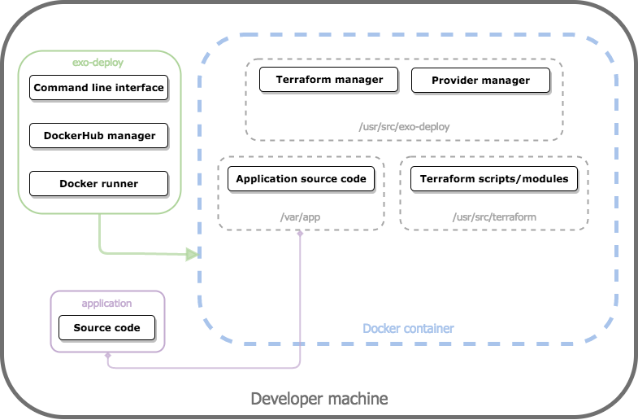
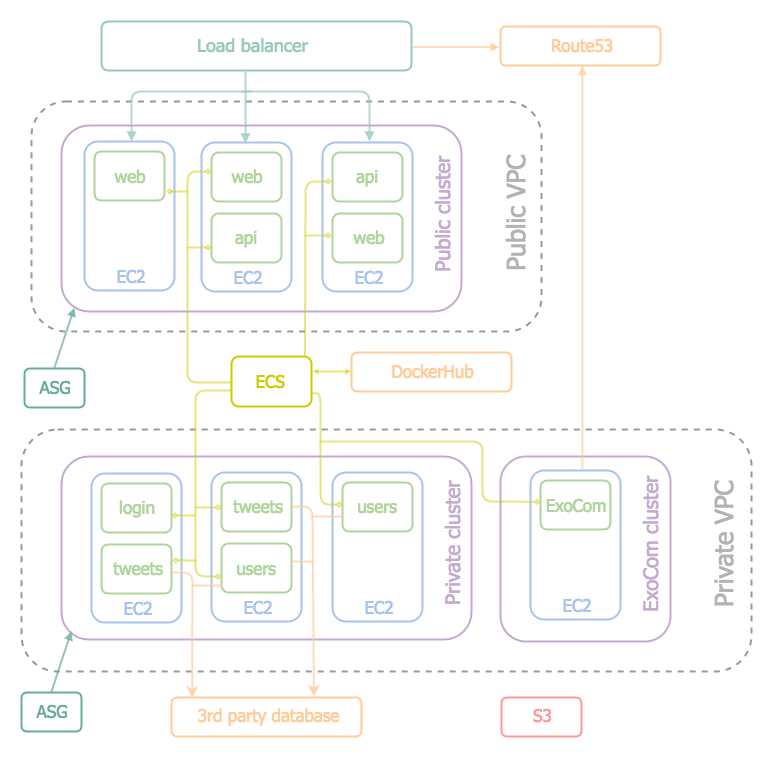

# Exosphere Developer Documentation

The Exosphere framework consists of these sub-projects:

## Exosphere SDK

Installation:
- add `./bin` and `./node_modules/.bin` to your PATH (in that order)
- install [Morula](https://github.com/Originate/morula)
- run `morula all setup`

<table>
  <tr>
    <td width="160"><a href="https://github.com/Originate/exosphere-sdk">Exosphere SDK</a></td>
    <td>Exosphere CLI code base</td>
    <td>
      
      
      
      
    </td>
  </tr>
  <tr>
    <td><a href="https://github.com/Originate/exo-add">exo-add</a></td>
    <td>implementation of the `exo add` command</td>
    <td>
      
      
      
      
      
    </td>
  </tr>
  <tr>
    <td><a href="https://github.com/Originate/exo-clone">exo-clone</a></td>
    <td>implementation of the `exo clone` command</td>
    <td>
      
      
      
      
      
    </td>
  </tr>
  <tr>
    <td><a href="https://github.com/Originate/exo-create">exo-create</a></td>
    <td>implementation of the `exo create` command</td>
    <td>
      
      
      
      
      
    </td>
  </tr>
  <tr>
    <td><a href="https://github.com/Originate/exosphere/tree/master/exo-deploy">exo-deploy</a></td>
    <td>implementation of the `exo deploy` command</td>
    <td>
      
    </td>
  </tr>
  <tr>
    <td><a href="https://github.com/Originate/exo-lint">exo-lint</a></td>
    <td>implementation of the `exo lint` command</td>
    <td>
      
      
      
      
      
    </td>
  </tr>
  <tr>
    <td><a href="https://github.com/Originate/exo-run">exo-run</a></td>
    <td>implementation of the `exo run` command</td>
    <td>
      
      
      
      
      
    </td>
  </tr>
  <tr>
    <td><a href="https://github.com/Originate/exo-setup">exo-setup</a></td>
    <td>implementation of the `exo setup` command</td>
    <td>
      
      
      
      
      
    </td>
  </tr>
  <tr>
    <td><a href="https://github.com/Originate/exo-sync">exo-sync</a></td>
    <td>implementation of the `exo sync` command</td>
    <td>
      
      
      
      
      
    </td>
  </tr>
  <tr>
    <td><a href="https://github.com/Originate/exo-test">exo-test</a></td>
    <td>implementation of the `exo test` command</td>
    <td>
      
      
      
      
      
    </td>
  </tr>
  <tr>
    <td><a href="https://github.com/Originate/exocom-dev">ExoCom-Dev</a></td>
    <td>development version of Exosphere's message bus</td>
    <td>
      
      
      
    </td>
  </tr>
  <tr>
    <td><a href="https://github.com/Originate/exorelay-js">Exorelay-JS</a></td>
    <td>Exosphere connector for Node developers</td>
    <td>
      
      
      
    </td>
  </tr>
  <tr>
    <td><a href="https://github.com/Originate/exoservice-js">Exoservice-JS</a></td>
    <td>helper to run lambda services written in Node.js</td>
    <td>
      
      
      
      
    </td>
  </tr>
  <tr>
    <td><a href="https://github.com/Originate/exocom-mock-js">ExoCom-Mock-JS</a></td>
    <td>mock version of Exocom for testing</td>
    <td>
      
      
      
    </td>
  </tr>
  <tr>
    <td><a href="https://github.com/Originate/exosphere-shared">exosphere-shared</a></td>
    <td>shared libraries for all Exosphere code bases</td>
    <td>
      
      
      
    </td>
  </tr>
</table>

## Micro Services

<table>
  <tr>
    <td><a href="https://github.com/Originate/exosphere-mongodb-service">MongoDB service</a></td>
    <td>a generic micro-service that stores data in MongoDB</td>
    <td>
      
      
      
    </td>
  </tr>
  <tr>
    <td><a href="https://github.com/Originate/exosphere-users-service">Users Service</a></td>
    <td>generic micro-service for user accounts</td>
    <td>
      
      
      
    </td>
  </tr>
  <tr>
    <td><a href="https://github.com/Originate/exosphere-tweets-service">Tweets Service</a></td>
    <td>micro-service that stores Tweets</td>
    <td>
      
      
      
    </td>
  </tr>
</table>

## Application Architecture

The Exosphere framework makes it very easy to create
applications consisting of lots of backend services,
and strongly encourages this pattern.
The graphic below shows the architecture of a simple Exosphere application.

* the application code is factored into individual services
  (shown in green)
* each service has one responsibility, and provides that generic and well
* service communicate via JSON (the universal data exchange language)
* ExoSphere (shown in blue)
  provides a shared communication bus called _ExoCom_
  for this application.
* the communication bus can be extended to clients via the _ExoCom gateway_
* the Exosphere framework provides infrastructure services
  like full-stack deployment, analytics, and devops support
  for the application

## Exo-deploy Documentation

The `exo-deploy` command deploys an Exosphere application to the cloud.

### Exo-deploy Architecture

Technologies used:
* __Amazon Web Services (AWS)__: A cloud infrastructure provider used
to host Exosphere applications. See [AWS architecture diagram](#aws-architecture-diagram)
for infrastructure architecture. Currently, AWS is the only provider supported by Exosphere.
* __Terraform__: A tool for building, changing, and tearing down cloud infrastructure. The desired infrastructure
can be defined in Terraform configuration files and is applied idempotently
against existing infrastructure. A key concept used in `exo-deploy` is that of Terraform modules. Modules
(as the name suggests) are modular groups of Terraform configurations that can be passed around and reused.
* __Docker__: Docker employs container technology that encapsulates a known environment (source code, libraries,
etc.) so that software can be run exactly the same each time, without the user having to download
extra dependencies.

Diagram of `exo-deploy` architecture:

_Execution flow:_ When the user executes `exo-deploy` on the command line, an application's Dockerized services are first pushed to DockerHub. If any of the teardown flags are passed, then this step is skipped.  Next, a Docker container is started,
which begins the Terraform processes that deploy an application to the cloud. The user's application directory
is mounted into the container so that the application configuration can read. Next, the current state of the cloud infrastructure is
pulled down, and Terraform scripts are generated with application specific information. Finally, the necessary Terraform modules
are downloaded and the actual changes to existing infrastructure are applied.

On application teardown, all the steps to generate Terraform scripts and download modules are skipped. The
current state of the infrastructure is simply read and the teardown operation performed.

Exo-deploy diagram key:

* __Application source code__: The application source code, which includes configuration files that
define what AWS resource types to use, as well as application domain name and public facing endpoints.
The application directory is mounted into the Docker container so that these configuration
files can be accessed from within the running container.
* __Command line interface__: The basic command line interface that the user interacts with. It interprets whether
the user wants to deploy, teardown, or completely remove all infrastructure to/from the cloud.
* __Docker runner__: Runs the `originate/exo-deploy` Docker image, which contains most of the deployment logic.
`exo-deploy` is run inside a Docker container because it uses Terraform, a dependency we do not want to require
the user to have.
* __DockerHub manager__: Pushes all of an application's Dockerized services to DockerHub so that AWS can
access those images in production.
* __Provider manager__: Manages all interactions with the infrastructure providers (currently only AWS):
  * If necessary, sets up the storage bucket where the infrastructure state is stored
  * If necessary, creates a hosted zone containing name server records (which the user has to register with their domain name)
* __Terraform manager__: The logic inside the `exo-deploy` container which performs all Terraform related functions:
  * Generates the Terraform scripts by rendering templates with application specific information
  * Pulls the current state of the infrastructure, which is stored remotely
  * Downloads the necessary Terraform modules and applies the actual changes to the existing infrastructure
* __Terraform scripts/modules__: The directory in which the Terraform scripts are generated, and where the
modules are downloaded.

### AWS Architecture

Technologies used:
* __Auto-scaling Group (ASG)__: Monitors a specific cluster of machines, spinning up and down instances as needed.
* __Elastic Compute Cloud (EC2)__: Provides compute resources (machines) that code is run on.
* __EC2 Container Service (ECS)__: Container management service which starts, stops, and spins up (Docker) containers
as needed.
* __Simple Storage Service (S3)__: Object storage for cloud applications.
* __Route 53__: A DNS service that directs user requests to infrastructure running on AWS.
* __Virtual Private Cloud (VPC)__: Allows the user to define a virtual network on a section of the AWS cloud.

_General architecture overview:_ In production, there are two main virtual networks: public and private.
Micro-services which are accessed by the user, such as a web page or API, are hosted on the public network.
A load balancer is placed in front of the public services to distribute incoming requests.
Micro-services which can otherwise remain hidden are hosted on the private network. The micro-services themselves are run
on a cluster of machines, which is managed by an ASG that spins up and spins down EC2 instances for
the cluster as needed. ECS manages all the micro-serivces running in Docker containers - it starts, stops and scales
these containers depending on application traffic. ExoCom receives its own cluster (consisting of only one machine)
on the private network. Its address is registered in Route53 and passed to each of the micro-services. Together,
all of this forms the infrastructure needed to host an Exosphere application on the cloud!

AWS diagram key:

* __ASG__: The auto-scaling group which manages a cluster of machines. In this current architecture it manages
the public and private clusters.
* __DockerHub__: The Docker image registry where an application's Dockerized services are held. ECS pulls images
from DockerHub and runs them on the managed clusters.
* __EC2__: The actual machines which the Dockerized micro-services are run on.
* __ECS__: The service which manages all the containers that together form a working application. It spins up new containers if
old ones crash, and scales the number of running containers depending on application traffic.
* __ExoCom cluster__: A cluster of a single machine which hosts ExoCom.
* __Load balancer__: Handles application traffic and distributes them across public facing services.
* __Microservices__ (in green): The Docker containers each running an instance of a micro-service.
* __Public cluster__: The cluster of machines which host the public facing services. It lives in the public VPC
and is accessible to internet traffic.
* __Public VPC__: The public subnet where public facing services such as a web server or API are hosted.
* __Private cluster__: The cluster of machines which host the private services. It lives in the private VPC.
* __Private VPC__: A private subnet for private services. It has tighter security protocols than the public subnet.
* __Route 53__: Routes user traffic to the public facing load balancer. It also contains the record for an ExoCom
specific address. This address points to the machine which ExoCom is running on, and is passed to each of the services
so that they can communicate with ExoCom.
* __S3__: A storage service which hosts the current state of the infrastructure. This way developers
of the same application can run `exo-deploy` from his or her machine and only apply changes to the
most up-to-date version of the application running in production.
* __3rd party database__: A third-party hosted database that services can write and read data from.
